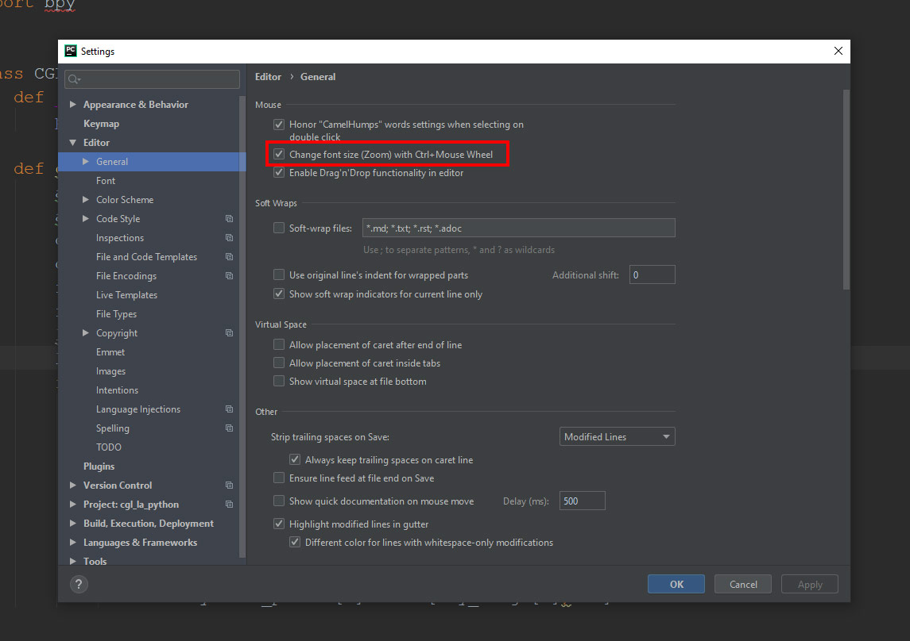
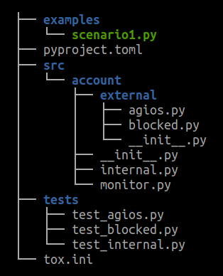
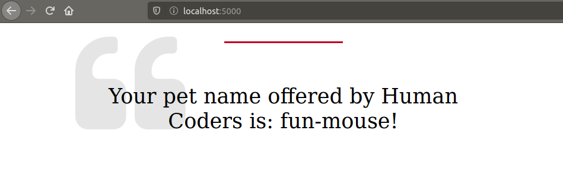
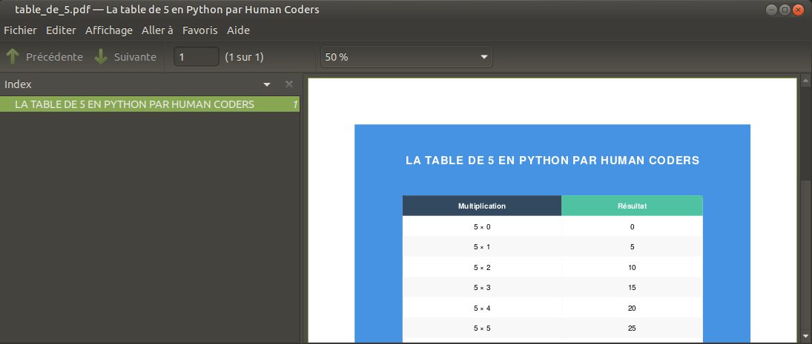
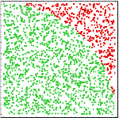
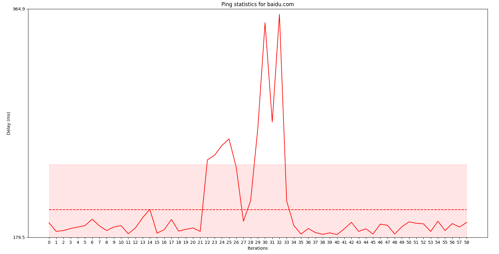

<!-- 
class: invert
paginate: true
footer: 'Python Starter training – exercices and mini-projects – Yoan Mollard – CC-BY-NC-SA [🔗](https://starter.python.training.aubrune.eu/)'
title: Exercises – Python Starter training
author: 'Yoan Mollard'
image: https://www.python.org/static/favicon.ico
-->

<style>
    .hljs-string {
    color: #cd9067;
}
</style>


# **Python Starter training**, exercises

Yoan Mollard, for **Human Coders**

https://starter.python.training.aubrune.eu/


---

#  List of mini-projects

[ Exercise 1. Practice Python's lists and dictionaries](#3)

[ Mini-project 2: The hanged man](#5)

[ Mini-project 3. Build a full package – Money transfer simulator](#9)

[ Mini-project 4. The e-mail address book](#25)

[ Mini-project 5A. Guess my number [Easy]](#32)
[ Mini-project 5B. The website generating animal name ideas [Medium]](#33)
[ Mini-project 5C. PDF files of multiplication tables [Medium]](#35)
[ Mini-project 5D. Estimate the value of π [Medium]](#38)
[ Mini-project 5E. The LOVE thematic quotation [Medium]](#40)
[ Mini-project 5F. Plot ping durations [Medium-Hard]](#41)
[ Mini-project 5G. A Graphical User Interface for traceroute [Hard]](#43)


---
# Exercise 1. Practice Python's lists and dictionaries

1. Open a System terminal in PyCharm. Type `activate` if you see no `(venv)` prefix

2. Install Jupyter Lab with `pip install jupyterlab` in the virtual environment 

3. Launch Jupyter Lab by typing `jupyter lab` in the same terminal

4. Right click the following notebooks and `Save As` in your PyCharm project's folder:

[1. Types.ipynb](https://github.com/ymollard/python-starter-slides/raw/main/exercises/1.%20Types.ipynb) – [2. Lists.ipynb](https://github.com/ymollard/python-starter-slides/raw/main/exercises/2.%20Lists.ipynb) – [3. Dicts.ipynb](https://github.com/ymollard/python-starter-slides/raw/main/exercises/3.%20Dictionaries.ipynb) – [4. Dataset.ipynb](https://github.com/ymollard/python-starter-slides/raw/main/exercises/4.%20Dataset.ipynb)

👀 _Make sure that Windows does not add extension `.txt` on its own_

5. Go back to JupyterLab, open and follow the downloaded notebook.

💡 Protip: `Shift + Enter` runs a cell. `Ctrl + M` and then `B` inserts a new cell Below

---

#  Enable zoom in Pycharm
From now, we will only use Pycharm.

Enable zooming with 
`Ctrl+wheel` in `File` > `Settings`: 


---

# Mini-project 2: The hanged man

You probably know the hanged man game:

1. The player is shown a secret word in which letters are hidden by underscores
2. Each turn, the player proposes a letter to unveil
3. If the chosen letter is part of the word, all their occurences are revealed

The goal is to reveal the secret word in less turns that there are letters in it. 

```
___IC__S_I_U_IO___LL_M___
   ________
   |       |
  \o/      |
   |       |
  / \      |
_______________________
```

---

1. Write a function `input_letter()` that asks the user to type a letter and returns it. This functions retries in case the user types anything that is not valid (a number, punctuation, several letters, ...).

**Note** : The function `input("Prompt:")` allows to read a string from the standard input

2. Test your function in the Pycharm Python console

3. Write a function `replace(letter, original_word, hidden_word)` that browses all characters of a partially hidden word (hidden by '_' characters) and reveals the requested letter at the right position if it is present in the original word.

**Be careful**: The `str` type is immutable, it means that you cannot replace a character in the middle of a string, you have to re-construct it char-by-char.

4. Test your function in the Pycharm Python console

---

5. Define and initialize the following variables to coherent initial values:
- `words`: a list of possible words to be guessed
- `secret_word`: a secret wrod randomly picked among the previous list (use for instance `random.choice`)
- `displayed_word`: the partially hidden word, i.e. the word of same length as the secret word in which every letter is remplaced by an underscore
- `max_attempts`: the number of remaining attempts

---

6. Add a **game loop** that:
- Displays the partially hidden word as well as the number of remaining attempts
- Prompts the player to enter a valid letter with  `input_letter()`
- Remplaces potential matches of this letter from `secret_word` in word `displayed_word`
- Checks the game state: exite the program with an appropriate message if the player wins or looses

You game must now be playable!

7. **Optional questions**:
- Store the 3 best scores in a JSON file, shown were the game starts.
- Install and use [`rich`](https://pypi.org/project/rich/) with [`click`](https://click.palletsprojects.com/) to make a beautiful interactive UI
- Draw a hanged man at each turn _(see the console drawing previously shown)_ 

---
# Mini-project 3. Build a full package – Money transfer simulator

In this exercise we are going to create a simplified Information System that is able to handle and simulate bank transactions.

In our scenario there are 4 actors: a bank (HSBC), a supermarket (Walmart), and 2 individuals Alice and Bob.

Each actor has his/her own bank account.

---
## Part 1: The basic scenario

- 1.1. Create a class `BankAccount` that owns 2 attributes:
  - `owner` (of type `str`): the owner's name
  - `balance` (of type `int`): the balance (do not take care of decimals)
  - the class constructor takes in parameter, in this order, `owner` and `initial_balance` 

With your class it must be possible to execute the following scenario (that has no effect so far, but it must not raise any error):
```python
bank = BankAccount("HSBC", 10000)
walmart = BankAccount("Walmart", 5000)
alice = BankAccount("Alice Worz", 500)
bob = BankAccount("Bob Müller", 100)
```

---
- 1.2. Implement the `print()` method in class `BankAccount` that displays the name of the owner and the current balance. Iterate on all accounts to print them.

- 1.3. Implement these methods :
  - `_credit(value)` that credits the current account with the value passed in parameter. We will explain the goal of the initial underscore later.
  - `transfer_to(recipient, value)` that transfers the value passed in parameter to the recipient passed in parameter
  
- 1.4. Run the following scenario and check that end balances are right:
  - 1.4.1. Alice buys $100 of goods at Walmart
  - 1.4.2. Bob buys $100 of goods at Walmart
  - 1.4.3. Alice makes a donation of $100 to Bob
  - 1.4.4. Bob buys $200 at Walmart

---
## Part 2: The blocked account

Bob is currently overdrawn. To prevent this kind of situation, its customer adviser prefers to convert his account into a blocked account. This way, any purchase would be refused if Bob had not enough money.

- 2.1. Create the `InsufficientBalance` exception type inheriting from `ValueError`

- 2.2. Implement a class `BlockedBankAccount` so that:
  - the `BlockedBankAccount` inherits from `BankAccount`. Make sure you do not forget to call parent methods with `super()` if necessary
  - the `transfer_to` methods overrides the parent method, with the only difference that it raises `InsufficientBalance` if the balance is not sufficiently provided to execute the transfer

---
- 2.3. Replace Bob's account by a blocked account and check that the previous scenario actually raises an exception

- 2.4. Protect the portion of code that looks coherent with `try..except` in order to catch the exception without interrupting the script

- 2.5. Explain the concept of protected method and the role of the underscore in front of the method name ; and why it is preferable that `_credit` is protected

---
## Part 3: The account with agios

In real life another kind of account exists: the account whose balance can actually be negative, but it that case the owner must pay agios to his(her) bank.

The proposed rule here is that, when an account is negative after an outgoing money transfer, each day will cost $1 to the owner until the next money credit.

To do so, we need to introduce **transaction dates** in our simulation.

---
- 3.1. Implement a class `AgiosBankAccount` so that:
  - the `AgiosBankAccount` inherits from `BankAccount`. Make sure you do not forget to call parent method with the `super()` keyword if necessary
  - the constructor of this account takes in parameter the account of the bank so that agios can be credited on their account.
  - the  `transfer_to` method overrides the parent method:
    - it takes the `transaction_date` in parameter, of type `datetime`
    (*also change the parent class and propagate the date when necessary*)
    - it records the time from which the balance becomes negative. You need an additional attribute for this.
  - the `_credit` method overrides the method from the parent class, with the only difference that it computes the agios to be payed to the bank and transfer the money to the bank. Round agios to integer values.

---
 - 3.2. Move the code computing the agios in a private method named `__check_for_agios`, explain the concept of private method and the role of the double underscore 
 - 3.3. Check your implementation with the previous scenario: After Bob has a negative balance, Alice makes him a transfer 5 days later: make sure that $5 of agios are payed by Bob to his bank.

---
## Part 4: The `account` package

We have just coded a very simple tool simulating transactions between bank accounts in Object-Oriented Programming.

In order to use it with a lot of other scenarii and actors, we are going to structure our code within a Python package.

We will organise our accounts with the following terminology:
- **bank-internal** accounts do not create agios and are not blocked, there are `BankAccount` and only banks can own such account
- **bank-external** accounts are for individuals or companies, they can be either blocked or agios accounts.

---
We would like to be able to import the classes from than manner:
```python
from account.external.agios import AgiosBankAccount
from account.external.blocked import BlockedBankAccount, InsufficientBalance
from account.internal import BankAccount
```


- 4.1. Re-organize your code in order to create this hierarchy of empty `.py` files first as on the figure.
Create an empty script `scenario1.py`for the scenario.


---


- 4.2. Move the class declaration of `AgiosBankAccount` in `agios.py`

- 4.3. Move the class declarations of `BlockedBankAccount` and `InsufficientBalance` in `blocked.py`

- 4.4. Move the class declaration of `BankAccount` in `internal.py`

- 4.5. Move the scenario (i.e. the successive instanciation of all accounts of companies and individuals) in `scenario1.py`

---

- 4.6. Check each module and add missing relative import statements 
Relative imports start with `.` or `..`

- 4.7. Check each module and add missing absolute import statements such as `datetime`

⚠️ Import statements in the scenario must not be relative because `scenario1.py` will be located outside package `account`. 

- 4.8. Add empty `__init__.py` files to all directories of the package.

- 4.9. Execute the scenario and check that it leads to the same result as before this refactoring

---
## Part 5: Test your package with `pytest`

- 5.1. Install `pytest` with pip
- 5.2. Create independant test files `tests/<module>.py` for each module of your package
- 5.3. Add an entry in `sys.path` pointing to the parent folder of your package so that pytest is able to locate and import your `account` package (*)
- 5.4. With the documentation of [`pytest`](https://docs.pytest.org/), implement unit tests for your classes and run the tests with pytest 

(*) *Note: This workaround is not ideal since this path is different on each system, and the situation will be fixed once the package will be made installable in Part 6.*

---
## Part 6: Automate package building and testing with `tox` (Optional)
### 6.1. Make your package installable

Refer to the doc about [package creation](https://packaging.python.org/tutorials/packaging-projects).

Create a metadata file `pyproject.toml` and update its metadata (package name, author, license, description...)

Delete the `sys.path` workaround in test files since your package is now installable. 

---

### 6.2. Install, configure and run `tox`
Refer to the [`tox` basic example](https://tox.wiki/en/latest/#basic-example). Create a basic `tox.ini` so that your package is built and tested against Python 3.10 and 3.9.

Install and run tox in your project. Make sure all tests pass in both environments.

Re-organise your project structure as proposed in the figure. In Pycharm *File > Settings > Project > Project Structure*, identify `src` as a source folder so that the linter can identify your source files.



---
## Part 7: Distribute your package on TestPyPi (Optional)
- 7.1. Refer to the doc about [package creation](https://packaging.python.org/en/latest/tutorials/packaging-projects/#creating-pyproject-toml) to create a minimal `pyproject.toml`
- 7.2. Name your package `accounts-<MYNAME>` and substitute your name
- 7.3. Install `build`, `wheel` and `twine`
- 7.4. Refer to the [doc](https://packaging.python.org/en/latest/tutorials/packaging-projects/#generating-distribution-archives) to build `sdist` and `bdist_wheel` distributions
- 7.5. Upload both distributions to TestPyPI using login `__token__`. For the password, ask for the token or create your own [TestPyPI account](https://test.pypi.org/account/register/) and new token.
- 7.6. Make sure you can install your package from the TestPyPI index via pip:
`pip install accounts-MYNAME --index-url https://test.pypi.org/simple/`

---

# Mini-project 4. The e-mail address book

We are going to write a Python script to handle e-mail addresses.

This contact manager will be named `contacts.py`. Your address book must accept these arguments:
1. a command: `add` `search` `del` to add, search or delete a contact
2. a `--book=<name>` option: with this option the user can select which of the address book (s)he wants to target: only `pro` and `perso` books.
3. a `--verbose` option that describes step-by-step what instructions are executed by the manager (for debug purposes) 
---
Here are, for instance, a few commands that your contact manager must accept:

```bash
./contacts.py add Maria --email maria@muller.me --book=pro
# Add or update a contact for name "Maria" in the professional book

./contacts.py search Maria
# Search all occurences of "Maria" in all books

./contacts.py del Maria --verbose
# Delete all occurences from all books matching exactly the name "Maria"
```

---

## Part 1: Arguments and base commands

1. Choose how your contacts will be represented in memory (Python dictionaries or lists ; or Python classes or ...)

2. Hard-code a few contacts in your script matching the representation that you chose and implement the function `add(contacts, book, name, email)` to add an element

3. Thanks to the help of [the argparse tutorial](https://docs.python.org/3/howto/argparse.html), declare an argument parser accepting a positional arguement `command` that might be `add`, `del` or `search` and for which the `add` command will call with a hardcoded name, a book and an address

---
4. If you run Unix, add the hashbang `#!/usr/bin/env python` that will tell the shell what is the interpreter to use for this script, and make it executable with `chmod +x`

5. In the terminal, call your script with option `-h` that is not implemented ; but that exists automatically as soon as we declare a parser


6. Call now your tool with a command: `./contacts.py add` and check that it actually added the hardcoded contact to the hardcoded book in memory (with a print)

7. Add positional arguments `name` and `email` so that name and mail are not longer hardcoded but can be passed in arguments and test

---

8. **Problem** : by doing this, we made `name` and `email` compulsory what ever the command is. However the `search` command does not require these arguments. There are several ways to fix this issue, the main one is the [sub-parser](https://docs.python.org/fr/3/library/argparse.html?highlight=subparser#argparse.ArgumentParser.add_subparsers). However in this exercise we propose an alternative solution:

9. Transform `email` in optional argument (i.e.`--email)` and change  `add()` in order to raise an exception if this argument is not provided

10. Add the optional argument `--book` (and its shortname `-b`) that accepts only these 2 book names: `pro` and `perso`, the latter being the default.

11. Update `add()` so that it uses the `--book` parameter

12. Implement the `search(..)` and `delete(..)` functions and test all use cases (inexisting contact, existing, forgotten argument, ...)

---

## Part 2: Regular expressions

1. Thanks to the [regex cheat sheet](https://www.debuggex.com/cheatsheet/regex/python), write a regex that matches e-mail addresses
2. In the Python console, use the `re` module to match your regex in a few examples 
3. Observe the value and the type returned by the matching function and use it in `add(..)` so that it refuses adresses that do not validate the regex
4. Test your address book by adding valid and invalid addresses

**Remark**: There is a `validate_email` package that is way more efficient in the e-mail validation process, but the goal here is to train with regexes

---

## Part 3: Recording books on disk

1. Choose how you will represent your books on disk (`json`, `csv`, in text file or `pickle` to record them in binary, one file or several files...)
2. Implement a reading function `read(contacts)` and a writing function `write(contacts)`, call them at the beginning and end of your script
3. Think to the special case where the file does not exist and must be created
4. Test!

## Resources:
- The `argparse` tutorial : https://docs.python.org/3/howto/argparse.html
- Regex cheat sheet: https://www.debuggex.com/cheatsheet/regex/python
- Regex `re` : https://docs.python.org/3/library/re.html?highlight=re#module-re


---

# Mini-project 5A. Guess my number [Easy]

Game rules: the computer randomly picks a number between 1 and 100000000 without revealing it to the player.
The player guesses a number and gives it to the computer that replies if the actual number is lesser or higher than the guess, and so on until the player guesses the right number. 

Once your game is playable, you may add the following features:

- Catch exceptions: what happens when the user enters text instead of a number?
- Record the gaming time in a variable and display it in the terminal
- Record and display the 3 best scores when the game starts, associated to player name (Pro-tip: use JSON to store data on disk)

---

# Mini-project 5B. The website generating animal name ideas [Medium]

`flask` is a Web micro-server ideal for basic websites not requiring any database, cache, serialisation, ...

The `petname` package generates animal names for instance `crazy-pangolin` or `rugged-salmon`.



---

Read the [flask quick start](https://flask.palletsprojects.com/en/1.1.x/quickstart/#a-minimal-application) and create a basic website serving a single HTML file containing a different animal name every time!

Proceed as follow:
- Create a HTL template with a basique CSS style and a single centred `<div>` containing a variable
- Create a WSGI Flask application that serves this template in endpoint `/` (i.e. `http://localhost:5000/`) after you filled in the `<div>` with a new animal name
- Start the Flask development server according to the tutorial
- Open URL http://localhost:5000/ to test!

---

# Mini-project 5C. PDF files of multiplication tables [Medium]

Your child need cheat sheets to review multiplication tables. Create a script that generates pretty A4 pages to be printed, for each multiplicator, e.g.:



---

In order to create a nice design, HTML and CSS will be your best friends. You can grab some table style online, and then 2 packages will do 99% of the job:
- `jinja2`: a templating system that has the same syntax than `flask`!
- `weasyprint`: a PDF document productor from HTML/CSS content 

⚠️ If your run Windows or MacOS, `weasyprint` requires Cairo and GTK that are not trivial to install. [Follow the installation guide](https://weasyprint.readthedocs.io/en/stable/install.html))

---

Proceed this way:
- Create a `table.html` template containing your its own `<style>` and variables that seems pertinent (e.g. the title, the multiplicator, the content of the table)
- In Python, open the template with `jinja2` and execute the HTML rendering into a string by filling up the variables with the right value
- In a single line of code, asks `weasyprint` to convert your HTML string into a PDF file
- Use `argparse` so that your script accepts in input the mulitplicator and the number of factors, e.g. `generate_table.py --multiplicator=5 --factors=12` to produce a table of 5x1, 5x2 ... till 5x12.

---

# Mini-project 5D. Estimate the value of π [Medium]


Compute a maximum number of decimals of π has become a challenge to benchmark CPUs. In particular, the **Monte-Carlo method** estimates the value of pi this way:

We estimate the area of 1/4 of a circle by picking at least 1 billion random points between 0 and 1.
We count all those which are inside the circle of radius = 1 (in green). Their sum is an estimate of the green 1/4 of circle.
Then, thanks to the well known formula `area = π x r²`, we deduce an estimate value of π!



---

Proceed this way:

1. Generate `n = 1000000` float abscissas (x-axis) as well as `n` float ordinates (y-axis) in range `[0; 1[`
2. Group these floats by two in order to get a list of couples: `[(x, y), (x, y), (x, y), …]`
3. Count how many `M(x,y)` points comply the following equation `x²+y² < 1` (call this number `m`)
4. The `m/n` is an estimate of the area of the 1/4 of circle of centre `0, 0` with radius `1`. Multiply this ratio per 4 to get the area of the full circle `A`, and since `A = n.r²` this result is also the estimate of `n`
5. With `pyplot.scatter(x, y, color=’green’)`, draw in green the points that are interior to the circle, and in red all others.

Note: use `pyplot.axis(‘equal’)` to get orthogonal axes 

---

# Mini-project 5E. The LOVE thematic quotation [Medium]

This is a program that displays a quotation about love every time you run it.
1. Use the `requests` package to retrieve the web page http://www.quotationspage.com/random.php
2. Use the `beautifulsoup4` package to deconstruct the HTML tree and extract all quotations in string variables
3. Iterate all found quotations in order to only display quotations that contain "love". If no such quotation is found, renew the request.

---

# Mini-project 5F. Plot ping durations [Medium-Hard]
`ping` is a network tool sending ICMP requests to hosts. An ICMP request is sent every second and displays its round-trip duration in milliseconds.

The project aims at developing a Python tool that plots durations of ping requests.



---

1. Use `argparse` to accept arguments `host` (string) and `iterations` (int)
2. Use `subprocess` to call `ping` on the host passed in argument
**On Windows**, pass `iterations` to `-n` and add argument `-t`.
**On Linux**, pass `iterations` to `-c`.
3. Capture the `stdout` stream of the subprocess into Python variables
4. Exclude header/footer lines and error lines based on their format (split strings on delimiters)
5. Convert each ping duration in millisec into a float and store the list of durations
6. Terminate the ping subprocess after the number of iterations passed in argument
7. Use `matplotlib` to plot all ping durations, a dashed mean plot (`style="--"`), and the standard deviation (`fill_between`) computed with `numpy`. 


_**Note:** ⚠️ `os.system` is deprecated, use `subprocess instead`_

---

# Mini-project 5G. A Graphical User Interface for traceroute [Hard]

`traceroute` is a command to display all routers in which an IP packet goes through before reaching its final server (this is called "a route").

Create a Graphical User Interface with `Qt` displaying in a table the route to reach `humancoders.com` from your computer. Some tips:

- Execute system commands from Python with [`subprocess`](https://docs.python.org/3/library/subprocess.html)
_(⚠️ `os.system` is deprecated)_
- Read the doc [`traceroute` for Linux](https://linux.die.net/man/8/traceroute) and [`tracert` for Windows](https://docs.microsoft.com/en-us/windows-server/administration/windows-commands/tracert)
- See tutorials [*Qt for Python* (`pyside2` aka `PyQt5`)](https://build-system.fman.io/pyqt5-tutorial) and for [tables](https://doc.qt.io/qtforpython/PySide2/QtWidgets/QTableWidget.html)
