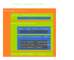
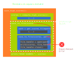
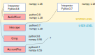
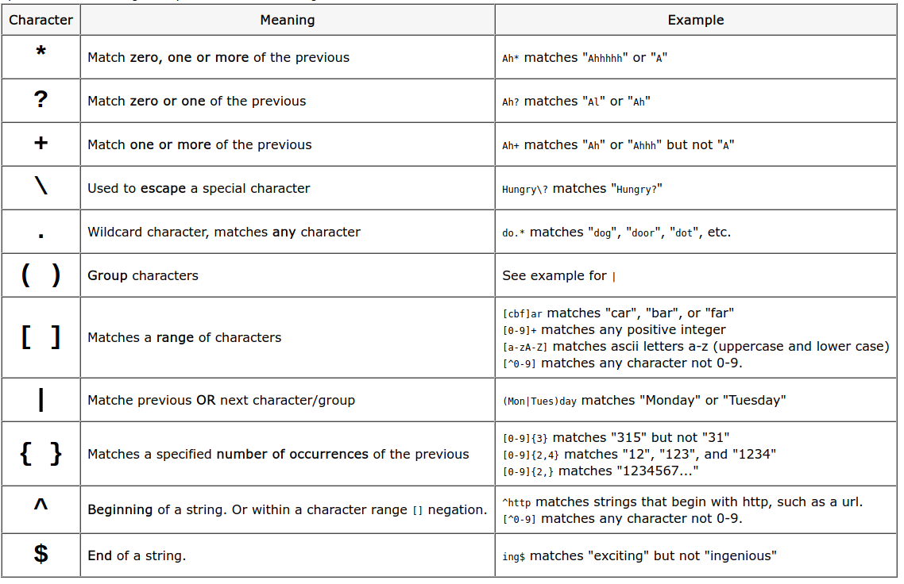
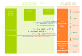
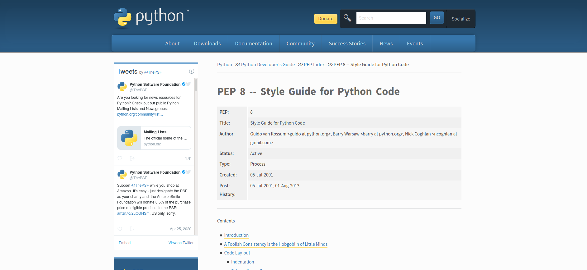
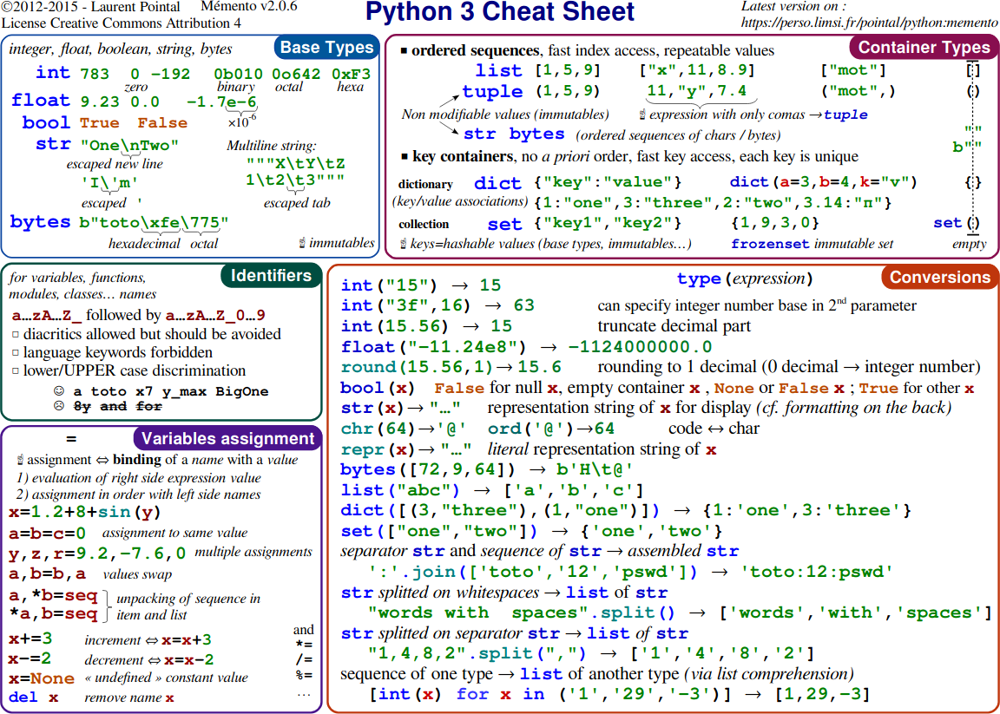
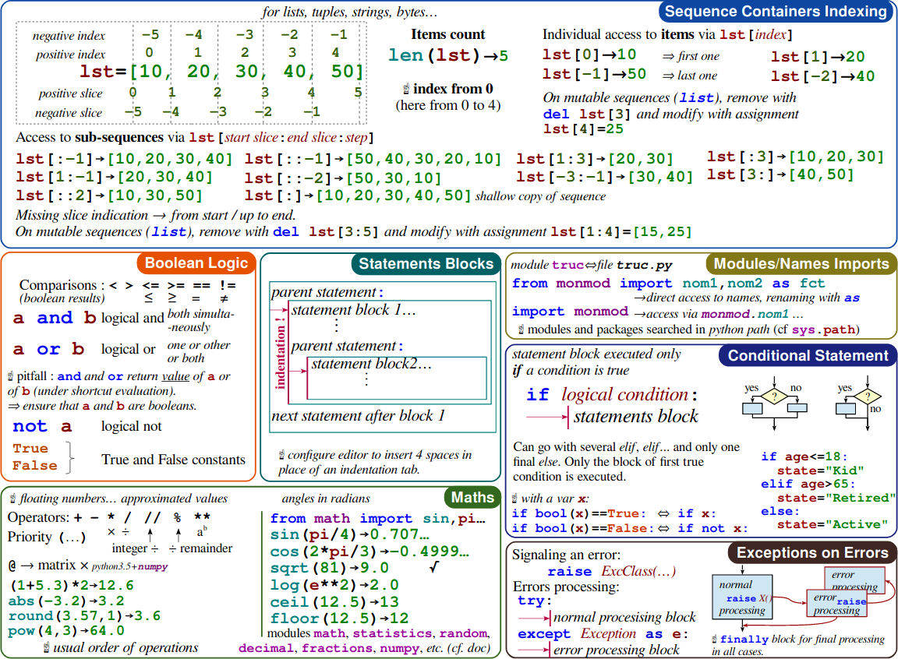
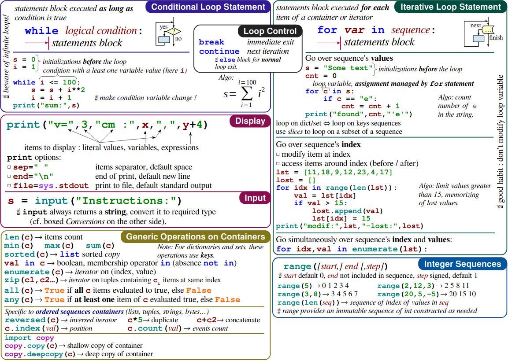
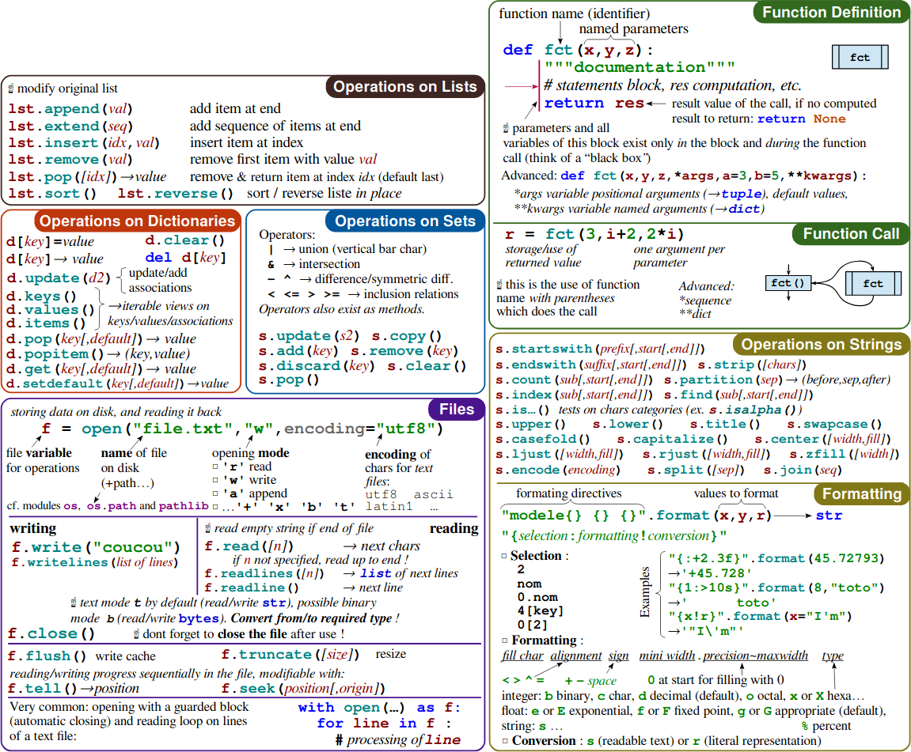

<!-- 
class: invert
paginate: true
footer: 'Python Starter training – course – Yoan Mollard – CC-BY-NC-SA [🔗](https://starter.python.training.aubrune.eu/)'
title: Course – Python Starter training
author: 'Yoan Mollard'
image: https://www.python.org/static/favicon.ico
-->

<style>
    .hljs-string {
    color: #cd9067;
}
</style>


#  **Python Starter training**

Yoan Mollard, for **Human Coders**

https://starter.python.training.aubrune.eu/


---

#  Schedule of DAY 1

1. [ CHARACTERISTICS AND SYNTAX OF PYTHON](#6)
    1.1. [ Characteristics](#10)
    1.2. [ Python's typing](#15)
    1.3. [ Control structures](#23)
    1.4. [ Exceptions](#40)
    1.5. [ Import and use installed libraries](#52)


---

#  Schedule of DAY 2

2. [ MODULES, PACKAGES AND LIBRARIES](#54)
    2.1. [ Structure of Python packages](#57)
    2.2. [ The Python Package Index (PyPI)](#61)
    2.3. [ Virtual environments (venv)](#66)
    2.4. [ Object-Oriented Programming (O.O.P.)](#75)


---

#  Schedule of DAY 3

3. [ POPULAR LIBRARIES](#90)
    3.1. [ Popular built-in libraries (coming with all Python distributions)](#91)
    3.2. [ Popular non-builtin libraries (to be installed with pip if needed)](#92)
    3.3. [ Other non-builtin libraries for code quality](#93)
    3.4. [ Charset and encoding](#98)
    3.5. [ The final point](#103)


---

#  List of mini-projects

[ Exercise 1. Practice Python's lists and dictionaries](/exercises.html#3)

[ Mini-project 2: The hanged man](/exercises.html#4)

[ Mini-project 3. Build a full package – Money transfer simulator](/exercises.html#8)

[ Mini-project 4. The e-mail address book](/exercises.html#24)

[ Mini-project 5A. Guess my number [Easy]](/exercises.html#31)
[ Mini-project 5B. The website generating animal name ideas [Medium]](/exercises.html#32)
[ Mini-project 5C. PDF files of multiplication tables [Medium]](/exercises.html#34)
[ Mini-project 5D. Estimate the value of π [Medium]](/exercises.html#37)
[ Mini-project 5E. The LOVE thematic quotation [Medium]](/exercises.html#39)
[ Mini-project 5F. Plot ping durations [Medium-Hard]](/exercises.html#40)
[ Mini-project 5G. A Graphical User Interface for traceroute [Hard]](/exercises.html#42)


---

#  DAY 1
# CHARACTERISTICS AND SYNTAX OF PYTHON

---

Python is an **Interpreted multi-paradigm programming language** from 1991\* for:
- **Data science**:
    - Data analysis (big data), dataviz, extrapolation, trends… 
    - Machine Learning: Torch, Tensorflow, Theano …
- **Web applications**: backends and servers
- **System administration**, scripting, automation
- **Business applications**: fat clients for the information system

\* It's older than Java!

---

### Pros

- **Concise** and readable language, no superfluous
- **Light syntax** to focus on the content, not the form
- **Fast prototyping** and development
- Automatic **memory management**
- A lot of libraries available in the PyPI index (store) + alternatives
- **Community-centric**: Documented on [docs.python.org](https://docs.python.org) + other community resources
- **Multiplatform**: Windows, UNIX, BSD, MacOS … even microcontrollers with 16k of RAM!
-  **Interoperable**: Bindings to C++/Java …


---
### Cons

- Slightly slower than compiled languages
- Only server-side, not suitable for mobiles
- Dynamic typing of variables (*duck typing*): 
    - Favors a high memory usage
    - Favors production errors (runtime exceptions):
        - e.g. add an integer with a string
        - e.g. use an undeclared variable


It is easy to make robust Python applications with good practices: e.g. explicit  typing and testing.


---
## Characteristics

- Interpreted language
- Multiparadigm: object, imperative and functional 
- Relies on *Duck typing* 🦆
- Indentation is part of the syntax
- Naming conventions:
    - `snake_case()` for variables and functions
    - `CamelCase` for class names 
- Parameters passing by reference, except primitive types

---
### The Python interpreter

Python files use extension `.py`, e.g.:

```python
# my_program.py 
print("Hello world")
```

You pass your Python code to a Python interpreter installed on your system, e.g. `C:\Python/python.exe` or `/usr/bin/python` ...

```bash
/usr/bin/python mycode.py
```


The interpreter:
- Compiles it in bytecode on-the-fly
- Runs the bytecode

---

The interpreter produces bytecode in files with `.pyc` and `.pyo` extensions and in  `__pycache__` folders.


As a developer, you can just ignore them, the interpreter handles compiling by itself.

Several implementations of the interpreter itself exist: `CPython` (The most popular implementation, in C), `Jython` (in Java), `Pypy` (in Python).

---

### The REPL
The REPL aka **Python console** or **Interactive Python**:


- **Read** the user input: a Python instruction
- **Evaluate** it 
- **Print** the result, if any
- **Loop** back to the beginning and read again


```ipython
user@computer:~ $ python
Python 3.9.5 (default, Nov 23 2021, 15:27:38) 

Type "help", "copyright", "credits" or "license" for more information.

>>> print("There are", 5 + 5, "apples in the basket")
There are 10 apples in the basket

>>> i = 6 + 6
```

---

### Programming paradigms
Python is multi-paradigm:
- **Imperative**: *instructions create state changes*
- **Object-oriented**: *instructions are grouped with their data in objects/classes*
- **Functional**: *instructions are math function evaluations*

All 3 paradigms are popular in the Python community, and often mixed all together.


---
## Python's typing
Python typing is **dynamic** and inferred from the value.

🦆 Definition of **duck typing**: An object that has certain properties is treated independently of its actual runtime class. 

**Example**: if `__contains__()` is available in type `T`, then `T` is a container.

### Primitive types
```python
i = 9999999999999999999999999        # int (Unbound integer)
f = 1.0                              # float
b = True                             # bool
c = 1 + 1j                           # complex
n = None                             # NoneType
```

---
🚨 **Beware with floats**

Python's floats are IEEE754 floats with mathematically incorrect rounding precision:
```python
0.1 + 0.1 + 0.1 - 0.3 == 0    # This is False 😿
print(0.1 + 0.1 + 0.1 - 0.3)  # Returns 5.551115123125783e-17 but not 0
```
Also, they are not able to handle large differences of precisions:
```python
1e-10 + 1e10 == 1e10          # This is True 😿
```
When you deal with float number and if precision counts, use the decimal module!
```python
from decimal import Decimal
Decimal("1e-10") + Decimal("1e10") == Decimal("1e10")   # This is False 🎉
```
Beware not to initialize `Decimal` with float since the precision is already lost: `Decimal(0.1)` will show `Decimal('0.10000000000000000555111512312578270215')`

---

### The string
The `str`type is an **immutable** string.

**Definition**: An object is said **immutable**  when its value(s) canot be updated after the initial assignment. Otherwise they are **mutable**.

```python
s = "A string is immutable"
```
Example: put the first letter of these sequences in lower case:
```python
s = "This does not work"
s[0] = "t"
# TypeError: 'str' object does not support item assignment

s = "t" + "This works!"[1:]
```

---
### The tuple
The tuple is the Python type for an **array**. It is an immutable sequence of objects:

```python
t = (42, -15, None, 5.0)

t = True, True, 42.5

t = (1, (2, 3), 4, [5,6])

element = t[1]  # Returns the "first" element from t 

```
It is also used during unpacking:
```python
a, b = b, a   # Value swapping
```
And this is the type used for returning several values in a function.

---
### The list

A list is a mutable sequence of objects using integer indexes:

```python
l = ["List example", 42, ["another", "list"], True]

l[0]   # Access index 0 of l, i.e. the first item

l[1:3]  # Return a sliced copy of l between indexes 0 (incl.) and 3 (excl.)

"to" in l    # Evaluates to True if "to" is in list l

l = list(("Conversion", "tuple", "to", "list"))

l = list("Hello")

l = "".join(["H", "e", "l", "l", "o"])

l.append("element") # Append at the end (right side)

l.pop()             # Remove from the end. pop(0) removes from the start
```

---

### The dictionary

The dictionary is a key-value pair container, mutable and ordered:

```python
d = {"key1": "value1", "key2": 42, 1: True} 
# Many types are accepted as keys or values, even mixed together

d["new key"] = ["new", "value"]   # Insertion of a new pair

"key1" in d   # Evaluates to True if "key1" is a key in d

dict(zip(("article", "price", "stock"), ("Logitech M180", 99.90, 5)))

d.update({"foo": "bar"})

d.keys()     # dict_keys ["key1", "key2", 1]

d.values()   # dict_values ["value1", 42, True]
```

*With Python 3.7 and below, dictionaries are unordered (see `OrderedDict` if needed)*

---

### Type hints

```python
i: int = 42
l: list = ["a", "b", "c"]
l: list[str] = ["a", "b", "c"]
d: dict[str, dict[str, list[str]]] = {"emails": {"Josh": ["josh@example.org", "contact@josh.me"]]}}
```

Typing is only intended for the type checker (e.g. `mypy`, or `Pycharm`).
At runtime, type hints are ignored by the interpreter but your IDE will report the type mismatch between the variable and the literal:

```python
i: int = 4.2
``` 

The `typing` module contains tools for advanced typing mechanisms:

```python
from typing import Optional, Union

number: Union[float, int, complex] = 4.2
value: Optional[list] = None
```

---
### Parameter passing

What happens during an assignment?
```python
list1 = [10, 20, 30]

list2 = list1     # Assignment by reference
```


Python passes parameters:
- by value for primitives types
(`int`, `float`, `bool`)
- by reference for all other objects

When you need a copy of the original:

```python
list2 = list1.copy()
```

---
## Control structures

### The `for` loop

```python
for i in range(10):
    print("element number", i)
```

Equivalent to the following loop in C:
```c
for(int i=0; i<10; ++i)
```

---

The general form is:
```python
for i in range(start_index, end_index_excluded, step):
    body
```

Equivalent to the following loop in C:
```c
for(int i=start_index; i<end_index_excluded; i+=step) 
```


When the iterator is not needed, the underscore is used as a variable name so that semantic checkers do not warn about a variable being declared but unused:

```python
for _ in range(10):
    _, result, _ = function()
```

---
The `for` loop can iterate any kind of values, e.g.:
```python
for item in ["starter", "dish", "dessert"]:
    print("Please eat your", item)
```

When both the index and the value are needed, use `enumerate()`:
```python
for index, item in enumerate(["starter", "dish", "dessert"]):
    print(item, "is at index", index)

# starter is at index 0
# dish is at index 1
# dessert is at index 2
```

`enumerate()` returns a list of tuples, that are unpacked within the `for` loop:

```python
[(0, "starter"), (1, "dish"), (2, "dessert")]
```

---
Iterating over a dictionary iterates on keys:
```python
menu = {"starter": "salad", "dish": "chicken", "dessert": "brownie"}
for key in menu: 
    print("Your", key, "is a", menu[key])

# Your starter is a salad
# Your dish is a chicken
# Your dessert is a brownie
```

When both the key and the value are needed, use `items()`:
```python
menu = {"starter": "salad", "dish": "chicken", "dessert": "brownie"}
for key, value in menu.items(): 
    print("Your", key, "is a", value)
```

---
### The `while` loop
```python
i = 100

while i > 0:
    print(i)
    i -= 1
```

There is no `do ... while` structure.

There is no `++` or `--` operator for increments.

---
Use logical operators `and`, `or`, `not` in order to build logical expressions:

```python

# For a looking for the first even integer whose square is > 1000
# While i is odd or its square is not > 1000

i = 0

while i%2 == 0 or not i*i > 1000:
    i += 1 

print("The searched integer is", i)   # The answer is 33
```

---

### The `if` statement

```python
if mark < 8:
    print("You failed the exam")
elif mark < 10:
    print("You must retake the exam")
else:
    print("You passed the exam")

```

Logical operators `and`, `or`, `not` can alos be used here.

---

### The `match ... case` statement

In Python 3.9 and below, no structure equivalent to the `switch() case:` in C exists.

In Python 3.10 and above:

```python
value = 10

match value:
    case 10:
        print("TEN")
    case 20:
        print("TWENTY")
    case _:
        print("OTHER VALUE")
```

---
### The `break` statement

The `break` statement exits the `for` or `while` loop:

```python
# The first even integer whose square is > 1000
i = 0

while True:      # Infinite loop
   if i%2 == 1 and i*i > 1000:
      break      # immediately quits the loop
   i += 1

print(i, "is the searched number")
```

---
### The `continue` statement

The `continue` statement aborts the current loop and resumes at the next value:

```python
integers = [-5, 10, 42, -9, 54, 1, -1, 55, -8, -84, 12]

# We want to call process(i) only on positive integers from the above list
for i in integers:
    if i <0:
        continue  # skips i since it's negative and jumps to the next i

    print(i, "is positive and must be processed")
    process(i)
```

---
### Function definition

```python
def my_custom_sum(a, b):
"""
Computes the sum of 2 floats or integers
:param a: the first element to sum
:type a: float or int
:param b: the second element to sum
:type b: float or int
:return: the sum of a and b
:rtype: float or int
"""
   return a + b
```

💡 **Good practice:** Add docstrings to your functions by using `"""`.

After typing `"""` Your IDE may autocomplete the docstring with a sketch.

The expected format of the docstring is **reStructuredText** but other formats exist.

Docstrings can also be used to document a variable, a class, a whole file... 

---

With explicit typing, type hints may be redundant with the docstring:
```python
from typing import Union

def my_custom_sum(a: Union[int, float], b: Union[int, float]) -> Union[int, float]:
    """
    Computes the sum of 2 floats or integers
    :param a: the first element to sum
    :type a: float or int
    :param b: the second element to sum
    :type b: float or int
    :return: the sum of a and b
    :rtype: float or int
    """
    return a + b
```

---

One can return 2 values or more:
```python
def compute(a, b):
   return a + b, a - b, a * b, a / b
```

Call to `compute()` returns a tuple that one can **unpack**:
```python 
sum, difference, product, quotient = compute(4, 6)
```

---

The star \* is the flag that means **0 or n values**. They are received in a list:

```python
def compute(*args):
    sum, difference, product, quotient = 0, 0, 1, 1
    for value in args:   # args is a list
        sum += value
        difference -= value
        product *= value
        quotient /= value
    return sum, difference, product, quotient

sum, *other_results = compute(42, 50, 26, 10, 15)
```

---

A **named parameter** is passed to a function via its name instead of its position:

```python
def sentence(apples=1, oranges=10):
   return f"He robbed {apples} apples and {oranges} oranges"

p = sentence(2, 5)
p = sentence()
p = sentence(oranges=2) 
```

The double star \*\* in the flag that means **0 or n named parameters**. They are received as a dictionary:

```python
def sentence(**kwargs):
    for item, quantity in kwargs.items():  # kwargs is a dict
        print(f"He robbed {quantity} {item}")

sentence(apples=2, oranges=5)
# He robbed 2 apples
# He robbed 5 oranges
```
---
### Built-in functions

- `len()`: Get the length (number of elements) of a container
- `min()`, `max()`: Get the minimum or maximum values in a container
- `sum()`: Get the sum of all elements in the container
- `round()`: Round a float to a specific number of digits
- `zip()`: Couple elements from several lists 2-by-2 (like a coat zipper)
- `int()`, `float()`, `list()`, `dict()`...: Convert the parameter (cast)

---

### Comprehensions
A **comprehension** is an inline notation to build a new sequence (list, dict, set).
Here is a **list-comprehension**:
```python
l = [i*i for i in range(10)]  # Select i*i for each i in the original "range" sequence
# Returns [0, 1, 4, 9, 16, 25, 36, 49, 64, 81]
```

You may optionally filter the selected values with an `if` statement:

```python
l = [i*i for i in range(100) if i*i % 10 == 0]  # Select values that are multiple of 10
# Returns [0, 100, 400, 900, 1600, 2500, 3600, 4900, 6400, 8100]

l = [(i, 2*i, 3*i) for i in range(5)] # Here we select tuples of integers:
# Returns [(0, 0, 0), (1, 2, 3), (2, 4, 6), (3, 6, 9), (4, 8, 12)]
```

Dict-comprehensions also work:
```python
d = {i: i*i for i in range(10)}
# Returns {0: 0, 1: 1, 2: 4, 3: 9, 4: 16, 5: 25, 6: 36, 7: 49, 8: 64, 9: 81}
```

---
## Exceptions

An exception is an error.

The mechanism of exceptions allows to trigger, propagate and fix errors according to a specific mechanism.

An exception can be:
- **raised** with the `raise` keyword: it is triggered
- **catched** with the `except` keyword: it is catched and a fix is provided

When it is catched, a fix (workaround) is executed. For instance, when `value = a / b` fails because b = 0, you might want to pursue the execution with `value = 0`.

---
### Propagation of exceptions

At runtime, if an exception is raised but not catched, it is automatically propagated to the calling function.

If it is not catched there either, it goes up again ... and again ...

If it reaches the top of the interpreter without being catched, the interpreter exits.

Propagation is one of the main benefits of exceptions that allows to find the right balance between:
- no error management
- all functions calls individually tested for errors

---



---


---


---



---


---


---

Compared to a custom handling of errors, exceptions have the following benefits:
- they propagate automatically: allowing to provide general workarounds for large parts of code
- they are typed and all exception types are hierarchized

---
### Common exception types
- `ValueError`: value error (e.g. square root of a negative number)
- `TypeError`: type error (e.g. adding an `int` with a `str`)
- `IndexError`: access to an index exceeding the list size
- `KeyError`: access to a dictionary key that does not exist
- `NameError`: undeclared variable name
- `IOError`: I/O error (e.g. corrupted data, inexisting file...)
- `KeyboardInterrupt`: received SIGINT signal (Ctrl +C)

---
### The try/except block

The basic syntax to catch an exception:
```python
try:
    protected_code()  # Raises IOError
except IOError:
    subtitution_code()
```

What happens at runtime:
```python
try:
    protected_code()  # Raises IOError
    skipped_code()
    skipped_code2()
except IOError:
    substituted_code()
    substituted_code2()
resumed_code()
resumed_code2()
```

---

### Other uses of exceptions

```python
try: # Different exception types associated to the same substitution block
    protected_code()
except IOError, FileNotFoundError:
    substitution_code()
```
```python
try:         # Different substitution blocks for different exception types
    protected_code()
except IOError:
    substitution_code1()
except FileNotFoundError:
    substitution_code2()
```
```python
if some_positive_value < 0:     # Trigger an exception by yourself
    raise ValueError("Negative values are not authorized")
```

---
## Import and use installed libraries

When a library is installed already, use `import` or `from ... import` statements to import and use it:

```python
import math
value = math.sqrt(25)
```
With `import`, resources are accessible by prefixing it by the name of the module.

```python
from math import sqrt
value = sqrt(25)
```
With `from ... import`, resources are loaded in the global scope and can be accessed without prefix. 

---
### Popular built-in libraries

- `math`, `time`, `random`
- `logging` handle and organize log entries (debug, info, warn...)
- `sys`: communicate with the interpreter (args, stdin, script exit ..) 
- `os`: communicate with the OS (file access, low level fd , os-specific ...)
- `json`, `csv`: (de)serialize data in format JSON/CSV
- `requests`: emit HTTP requests
- `re`: regular expressions
- `socket`: low level network sockets
- `argparse`: access, typing and management of script parameters

Libraries are **buit-in** if they are pre-installed with any Python interpreter (the standard library). Other libraries can be installed with `pip`.

---

#  DAY 2
# MODULES, PACKAGES AND LIBRARIES

---

### Difference between modules and packages

A **module** is a Python file, e.g. `mymodule.py`. The module name is `mymodule`

Either the module is made to be:
- imported: it is a **package**: `import mymodule`
- executed: it is a **script**: `python mymodule.py`

A package can also be a folder containing modules and sub-packages.

Modules can also be bindings, e.g. Python bindings to a C++ library.

---
### Scripts : the shebangs

On UNIX OSes (UNIX, Linux, MacOS), a `shebang` is a header of a Python script that tells the system shell which interpreter is to be called to execute this Python module.

Usually, we invoke the `env` command to tell which is the interpreter for `python3` with such header:

```python
#!/usr/bin/env python3
```

Direct call to the interpreter is possible but NOT recommended, since it will force the interpreter by ignoring any virtual environment you could be in:
```python
#!/usr/local/bin/python3
```

The Windows shell ignore shebangs.

---

### Packages : the `sys.path` variable

When importing a package with the `import` statement, the interpreter seeks for it in `sys.path`. 

This is a regular Python list and it can be modified at runtime (with `append`) to add paths to your libraries.

However installable packages and recommanded and do not need this trick.


---
## Structure of Python packages
- Packages and sub-packages allow to bring a hierarchy to your code
- The package's hierarchy is inherited from the files-and-folders hierarchy 
- Modules hold resources that can be imported later on, e.g.:
  - Constants
  - Classes
  - Functions...


---
- All packages and sub-packages must contain an `__init__.py` file each
- In general `__init__.py` is empty but may contain code to be executed at import time


Then the package or its sub-packages can be imported:
```python
import my_math.trigo
my_math.trigo.sin.sinus(0)
```
Specific resources can also be imported:
```python
from my_math.matrix.complex.arithmetic import product
```

_Note: The double-underscore is called **dunder**_

---

### Relative imports (Imports internal to a package)
Relative import from the same folder:
```python
from .my_math import my_sqrt
value = my_sqrt(25)
```

Relative import from a parent folder:
```python
from ..my_math import my_sqrt
value = my_sqrt(25)
```

- Do not put any slash such as ~~`import ../my_math`~~
- Only current and parent folders can be retrieved with a relative import

---
## The Python Package Index (PyPI)
**PyPI** is a global server that allows to find, install and share Python packages.

It is operated by the **Python Packaging Authority (PyPA)**: a working group from the **Python Software Foundation (PSF)**.

The command-line tool **Package Installer for Python (pip)** can be used to install packages by their name, e.g. `bottle`. It can install from various sources (Link to code repos, ZIP file, local server...) and automatically seeks on PyPI if no source is given:

```bash
pip install git+https://github.com/bottlepy/bottle
pip install https://github.com/bottlepy/bottle/archive/refs/heads/master.zip
pip install path/to/my/python/package/folder/
pip install path/to/my/python/package/zip/file.zip
pip install numpy    # Will seek on PyPI
pip install numpy==1.21.5   # Force a specific version
```

---

```bash
pip install -r requirements.txt
```

As a convention, the `requirements.txt` file provides of packages when they are not installable.

```python
# requirements.txt
redis==3.2.0
Flask
celery>=4.2.1
pytest
```

In that case, this file is placed at the root of the package.

However, installable packages are recommended. In that case, dependencies are handled by `setuptools`.


---
### PyPI Security warning 🚨
[PyPI packages caught stealing credit card numbers & Discord tokens](https://www.bleepingcomputer.com/news/security/pypi-packages-caught-stealing-credit-card-numbers-discord-tokens/)


---
### Perform sanity checks before installing a package

- Is the package still maintained **and** documented?
```
Last update: November, 2017
```
- Does the developer consider bugs and improvements?
```
# of solved Github issues
```
- Is the package developer reliable?
```
Moral entity or individual, which company, experience...
```
- If not opensource, is the development of this package likely to continue?
```
# of opensource users, # of clients, company financial health if not opensource, ...
```

---
### PyPI Typosquatting warning 🚨

```python
pip install -r requirements.txt
# 🚨 pip install requirements.txt

pip install rabbitmq
# 🚨 pip install rabitmq

pip install matplotlib
# 🚨 pip install matploltib
```

---
## Virtual environments (venv)

**Context:** All installed packages go into the `site-packages` directory of the interpreter.

> The venv module provides support for creating lightweight “virtual environments” with their own site directories, optionally isolated from system site directories.

> Each virtual environment has its own Python binary (which matches the version of the binary that was used to create this environment) and can have its own independent set of installed Python packages in its site directories.

[🐍 Learn more](https://docs.python.org/3/library/venv.html)

---


---


---


---


---


---
For each new project you create/clone, create it its own dedicated virtual environment:
```bash
/usr/bin/python3.9 -m venv dev/PythonTraining/venv
```

Then, every time you work on this project, activate its environment first:
```bash
source PythonTraining/venv/bin/activate
```

Your terminal must prefix the prompt with the name of the env:
```bash
(venv) yoan@humancoders ~/dev/PythonTraining $
```
And quit the venv every time you stop working on the project:
```bash
(venv) yoan@humancoders ~/dev/PythonTraining $ deactivate
yoan@humancoders ~/dev/PythonTraining $ 
```

---
In an activated venv, every call to the interpreter and every package installation will target the isolated virtual environment:

```bash
(venv) yoan@humancoders ~/dev/PythonTraining $ python
```
will run the Python version targeted by the venv

```bash
(venv) yoan@humancoders ~/dev/PythonTraining $ pip install numpy
```
will install the latest numpy version into the venv

```bash
(venv) yoan@humancoders ~/dev/PythonTraining $ pip install numpy==1.21.0
```
will install the specific numpy version into the venv

---
In practice, your IDE can handle venv creation, activation and deactivation automatically for you when you create or open/close a project.


---

## Object-Oriented Programming (O.O.P.)

Here is a program to handle the sales of an apartment:

```python
apartment_available = True
apartment_price = 90000

def sell():
   apartment_available = False

def reduce_price(percentage=5):
   apartment_price = apartment_price * (1-percentage/100)

```
_Note: because of the scope of variables, global variables would be required here_

---

In classic programming, these are **variables**...
```python
apartment_available = True
apartment_price = 90000
```
... and these are **functions**:
```python
def sell():
   apartment_available = False

def reduce_price(percentage=5):
   apartment_price = apartment_price * (1-percentage/100)

```

---

However, functions usually manipulate on data stored in variables. So functions are linked to variables.

In Object-Oriented Programming, variables and functions are grouped into a single entity named a **class**:

```python
class Apartment:
    def sell():
        apartment_available = False

    def reduce_price(percentage=5):
        apartment_price = apartment_price * (1-percentage/100)
```
_Note: this intermediary explanation is not yet a valid snippet_

---

Object-Oriented Programming introduced specific vocabulary:

Types are called **classes**:

```python
class Apartment:   
```

Functions are called **methods**:
```python
    def sell():    
```

Variables are called **attributes**:
```python
        apartment_available = False
```

---
Since a class is a type (here, `Apartment`), the program can declare several independant apartments:

```python
apartment_dupont = Apartment()
apartment_muller = Apartment()

apartment_dupont.reduce_price(15)
apartment_muller.reduce_price(7)
apartment_dupont.sell()
apartment_muller.reduce_price(3)
apartment_muller.sell()
```

---

```python
apartment_dupont = Apartment()
```
In this statement:
- `Apartment` is a **class**
- `apartment_dupont` is an **object** (an instance of a class)
- `Apartment()` is the **contructor** (the method creating an object out of a class)

---

```python
apartment_dupont.reduce_price(15)
```

This statement is a **method call** on object `apartment_dupont`.

Method calls can create **side effects** to the object (modifications of its attributes).

Like regular functions, methods can take parameters in input. Here, an integer, 15.

---

### The `self` object

- `self` is the name designating the instanciated object
- `self` is implicitly passed as the first argument for each method call
- `self` can be read as "*this object*"

In other languages like Java or C++, `self` is named `this`.

### The constructor

The **constructor** is the specific method that instanciates an object out of a class. It is always named `__init__`.

```python
class Test:
    def __init__(self):
        self.attribute = 42
```

---

Here is now a valid Python syntax for our class.

This is the class **declaration**:

```python
class Apartment:
    def __init__(self):       # Implicit first parameter is self
        self.available = True       # We are creating an attribute in self
        self.price = 90000

    def sell(self):
        self.available = False

    def reduce_price(self, percentage=5):
        self.price = self.price * (1-percentage/100)
```

This is the class **instanciation**:
```python
apart_haddock = Apartment()
```

---

The constructor, like any other method, can accept input parameters:

```python
class Apartment:
   def __init__(self, price):
	   self.available = True	
	   self.price = price

apart_dupont = Apartment(12000)    # Now the price is compulsory
apart_haddock = Apartment(90000)
```

In general, most attributes can be read and written as regular variables:
```python
print(f"This flat costs {apart_haddock.price}")
apart_haddock.available = False
```

---

However some attributes may have a protected or private scope:
```python
class Foo:
    def __init__(self):
        self.public = 0
        self._protected = 0
        self.__private = 0        # ⚠️ Name mangling applies here
```

Respect of protected attributes is not enforced but private ones rely on name mangling:

```python
class BankAccount:
     def __init__(self):
         self.__balance = 3000
         
class Client:
     def make_transaction(self, bank_account: "BankAccount"):
         bank_account.__balance += 1000
         
Client().make_transaction(BankAccount())
# AttributeError: 'BankAccount' object has no attribute '_Client__balance'
```

---
### Inheritance

A furnished apartment is the same as an `Apartment`... bus with additional furniture.

```python
class FurnishedApartement(Apartment):   # The same as an Apartment...
   def __init__(self, price):
	   self.furnitures = ["bed", "sofa"]  # ...but with furniture	
	   super().__init__(price)


furnished_apart = FurnishedApartment(90000)
furnished_apart.available = False
furnished_apart.reduce_price(5)
furnished_apart.furnitures.append("table")
```

The `super()` function allows to call the same method in the parent class. 

_Note: Former Pythons require a longer syntax: `super(CurrentClassName, self)`_

---

### Terms from object-oriented programming (O.O.P.) to remember:

- A **class** is a type owning attributes and methods
- An **object** is an instance of a class
- Instanciating a class consists into building an object from this class
- The **constructor** is the method initializing the object: `__init__()`
- An **attribute** is a variable from a class (or from an object)
- A **method** is a function from a class (or from an object)
- A (child) class may **inherit** from another (parent), and may **override** its methods

---

### Magic methods


- apart1 + apart2		→ `Apartment.__add__(self, other)`    		→ Addition
- apart1 * apart2		→ `Apartment.__mul__(self, other)`    		→ Multiplication
- apart1 == apart2 		→ `Apartment.__eq__(self, other)`			→ Equality test
- str(apart)			→  `Apartment.__str__(self)`				→ Readable string
- repr(apart)			→  `Apartment.__repr__(self)`				→ Unique string
- `getattr(apart, "price")`	→  `Apartment.__getattr__(self, name)`		→ Get an attribute
- `setattr(ap, "price", 10)`	→  `Apartment.__setattr__(self, name, val)`	→ Set an attribute

_Magic methods are also named **dunder methods**_

---

```ipython
In [1]: dir(int)

Out[1]: 
['__abs__', '__add__', '__and__', '__bool__', '__ceil__', '__class__', 
'__delattr__', '__dir__', '__divmod__', '__doc__', '__eq__', '__float__', 
 '__floor__', '__floordiv__',  '__format__', '__ge__', 
 '__getattribute__', '__getnewargs__',  '__gt__', '__hash__', '__index__', 
  '__init__', '__init_subclass__',   '__int__', '__invert__', '__le__', 
  '__lshift__', '__lt__', '__mod__',   '__mul__', '__ne__', '__neg__', 
  '__new__', '__or__', '__pos__',   '__pow__', '__radd__', '__rand__', 
  '__rdivmod__', '__reduce__',   '__reduce_ex__', '__repr__', 
  '__rfloordiv__', '__rlshift__',   '__rmod__', '__rmul__', '__ror__', 
  '__round__', '__rpow__',   '__rrshift__', '__rshift__', 
  '__rsub__', '__rtruediv__',   '__rxor__', '__setattr__', 
  '__sizeof__', '__str__', '__sub__',   '__subclasshook__', '__truediv__', 
   '__trunc__', '__xor__',    'as_integer_ratio', 'bit_length', 
   'conjugate', 'denominator',    'from_bytes', 'imag', 'numerator', 
   'real', 'to_bytes']
```

---
#  DAY 3
# POPULAR LIBRARIES

---

## Popular built-in libraries (coming with all Python distributions)

- [`math`](https://docs.python.org/3/library/math.html), [`time`](https://docs.python.org/3/library/time.html), [`random`](https://docs.python.org/3/library/random.html), [`re`](https://docs.python.org/3/library/re.html): tools for *math*, *time*, *random generation* & *regexes*
- [`logging`](https://docs.python.org/3/library/logging.html): handle log files and streams with different levels and filters
- [`pathlib`](https://docs.python.org/3/library/pathlib.html): handle file paths, discriminate files and folders, check file existence...
- [`sys`](https://docs.python.org/3/library/sys.html): communicate with the interpreter (args, stdin, script exit ..) 
- [`os`](https://docs.python.org/3/library/os.html): communicate with the OS (file access, low level fd , os-specific ...)
- [`json`](https://docs.python.org/3/library/json.html), [`csv`](https://docs.python.org/3/library/csv.html): (de)serialize data in format JSON/CSV
- [`requests`](https://docs.python.org/3/library/requests.html): emit synchronous HTTP requests
- [`socket`](https://docs.python.org/3/library/socket.html): low level network sockets
- [`argparse`](https://docs.python.org/3/library/argparse.html): access, typing and management of script parameters
- [`asyncio`](https://docs.python.org/3/library/asyncio.html): Asynchronous I/Os with coroutine-based concurrent code (_promises_)


---

## Popular non-builtin libraries (to be installed with pip if needed)

- [`numpy`](https://numpy.org/), [`matplotlib`](https://matplotlib.org/), [`scikit-learn`](https://scikit-learn.org/), [`pandas`](https://pandas.pydata.org/): numerical calculus & data 
- [`click`](https://click.palletsprojects.com/): beautiful command line interfaces
- [`sqlalchemy`](https://www.sqlalchemy.org/): connect to a databse, emit SQL requests (ORM)
- [`redis`](https://redis.io/): inter-processus messaging (NoSQL database)
- [`pillow`](https://python-pillow.org/), [`opencv`](https://opencv.org/): open, convert, resize… images and pictures
- [`beautifulsoup`](https://www.crummy.com/software/BeautifulSoup/): extract data from XML or HTML files
- [`tornado`](https://www.tornadoweb.org), [`django`](https://www.djangoproject.com/), [`gunicorn`](https://gunicorn.org/), [`flask`](https://flask.palletsprojects.com/), [`bottle`](https://bottlepy.org/): HTTP/WSGI servers
- [`pygame`](https://www.pygame.org): Swiss knife of videogames (SDL 2D, audio, joysticks…)
- [`setuptools`, `wheel`, `build`, `twine`](https://packaging.python.org/guides/distributing-packages-using-setuptools/): package distribution
- [`pyqt`](https://wiki.python.org/moin/PyQt), [`tkinter`](https://wiki.python.org/moin/TkInter): graphical interfaces for fat clients: windows, buttons...

---

## Other non-builtin libraries for code quality
- [`sphinx`](https://www.sphinx-doc.org): build beautiful documentation out of code documentation
- [`pytest`](https://pytest.org/), [`unittest`](https://docs.python.org/3/library/unittest.html): test frameworks
- [`tox`](https://tox.readthedocs.io/): test automation (e.g. _Continuous Integration_)
- [`mypy`](http://mypy-lang.org/): static type checker for annotated code (see [PEP 484 Type Hints](https://www.python.org/dev/peps/pep-0484/))
- [`pytype`](https://google.github.io/pytype/): type checker for unannotated code
- [`pylint`](https://www.pylint.org/), [`pyflakes`](https://libraries.io/pypi/pyflakes): Syntactic and semantic checkers (linters)
- [`pep8`](https://pep8.org/): Style checker


---

All builit-in libraries are documented in 8 languages on:
###  [📖 docs.python.org](https://docs.python.org/)
This documentation is community-written.

Non-builtin libraries (e.g. those that you install via pip) usually have their documentation on their own web server. 

Also, [readthedocs.io](https://readthedocs.io/) is a common place for some of them.

---
### Regular expressions `re`

Match patterns from a text: 
- E-mail addresses: `foo@bar.fr`
- IP addresses: `192.168.2.10`
- Version numbers: `4.5.1`
- Postcodes: `75005`
- etc...




---

```python
import re

re.match(r"[0-9]{5}",
         "75000 Paris")

re.match(r"^[0-9]{5}$",
         "75000")

re.match(r"^[0-9]+\.[0-9]+\.[0-9]+\.[0-9]+$",
         "192.168.1.100")
```

---

### Argument parsers `argparse`

```bash
./contacts.py add Mary --email m@test.fr 

./contacts.py del Mary

./contacts.py -h

./divide.py 10 30 --euclidian --verbose=2
```

- Positional arguments
- Optional arguments
- Sub-parsers
- Documentation and descriptions

---

## Charset and encoding

All text assets (Python string or `.py` file, `.json` file, `.txt` file…) are encoded using a **charset**, a correspondance table between **Bytes ↔ Actual character**

- e.g. in `utf-8`: `0xC3A9` ↔ `é`
- e.g. in `latin-1`: `0xE9` ↔ `é`

You **MUST** know the encoding of a text asset in order to read it.

If you do not, it can be guessed but there is a chance to make mistakes.

This is what happens if you do not specify explicit encodings and rely on default parameters of file reading libraries.

If the guess is wrong it may result in e.g. `hétérogène` instead of `hétérogène`.

---

- `Unicode` is the world set of all code points (~ characters) e.g. `U+1F601`: 😁
- The Python interpreter holds:
  * decoded unicode strings in type `str`
  * encoded strings in type `bytes`
- `encode()` and `decode()` methods on these objects can convert them between `bytes` and `str`
- All I/Os, data coming in and out of the interpreter, must be respectively decoded and encoded with the charset expected by the recipient
- stdout and stderr in your terminal are outputs, they have a charset
- stdin in your terminal is an input, it has a charset 
- Your `.py` file itself is an input, it has a charset

---

### Rule of thumb for encoding and decoding

- I **RECEIVE** data coming **IN** the interpreter (from stdin, the network, a file...):

    * If it is a `str`: it has already been decoded by reading functions
_(Prey that they used the right charset 🙏)_
    * If it is a `bytes`: decode-it with the charset declared by the source e.g.
`data.decode("utf-8")` if the source sends UTF-8 strings

- My Python code must operate only on Unicode (Python type `str`)

- I **SEND** data **OUT** of the interpreter (to stdout, to the network, to a file...):

    * If it is a `bytes`: it has already been encoded by writing functions
_(Prey that they used the right charset 🙏)_
    * If it is a `str`: encode-it with the charset declared by the recipient e.g.
`data.encode("utf-8")` if the recipient expects UTF-8 strings 


---

### What is Unicode?

Unicode is NOT a charset, this is the global table of **all world code points**.

**Encodings** (*ASCII, latin-1, UTF-8...*) may be able to code Unicode in whole or in part.

**ASCII** and **latin-1** can only code a subset of Unicode (resp 128 and 256 code points).

**UTF-8**, **UTF-16** and **UTF-32** can code all Unicode code points.

The difference between UTF-8, 16 and 32 is about how they code characters:
- UTF-8 uses a variable number of bytes
- UTF-16 uses a variable number of bytes
- UTF-32 uses a fixed number of 4 bytes 

In average, UTF-16 is more efficient for Asian texts compared to UTF-8. But UTF-8 is more widely recommanded as a global standard.

---



---

## The final point

As of November, 2022, Python 3.10 and 3.11 are the stable versions.

Python 2 is no longer supported since January, 2020: forget it!

Main differences Python 2 → Python 3:

- `print "Hello"`							→ `print("Hello")`
- `raise ValueError, "problem!"`	→ `raise ValueError("problem!")`
- `type(1/3) == int` 						→ `type(1/3) == float`
- `str` (encoded)/`unicode` (decoded)	→ `str` (decoded)/`bytes` (encoded)
- `# encoding: utf8` (ASCII by default)		→ (UTF-8 by default)
- `zip([0,1], [8,9]) == list`				→ `zip([0,1], [8,9]) == zip_object` (generator)

---

### The [Python Enhancement Proposals (PEP)](https://www.python.org/dev/peps/) and the [PEP 8](https://www.python.org/dev/peps/pep-0008/)



---



---



---



---



