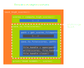
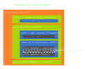
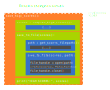
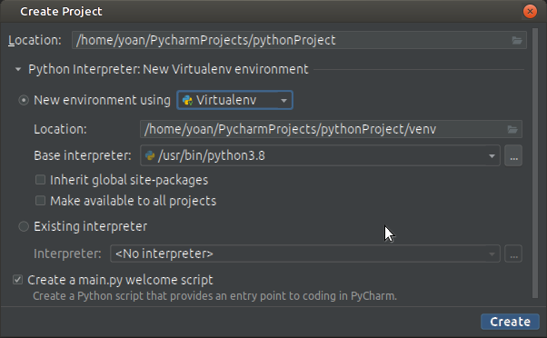

<!-- 
class: invert
paginate: true
footer: 'Python Starter training – course – Yoan Mollard – CC-BY-NC-SA [🔗](https://starter.python.training.aubrune.eu/)'
title: Course – Python Starter training
author: 'Yoan Mollard'
image: https://www.python.org/static/favicon.ico
-->

<style>
    .hljs-string {
    color: #cd9067;
}
</style>


#  **Python Starter training**

Yoan Mollard, for **Human Coders**

https://starter.python.training.aubrune.eu/


---

#  Schedule of DAY 1


---

#  Schedule of DAY 2


---

#  Schedule of DAY 3


---

#  List of mini-projects


---

#  DAY 1
# CHARACTERISTICS OF PYTHON

---

Python is an **Interpreted multi-paradigm programming language** from 1991\* for:
- **Data science**:
    - Data analysis (big data), dataviz, extrapolation, trends… 
    - Machine Learning: Torch, Tensorflow, Theano …
- **Web applications**: backends and servers
- **System administration**, scripting, automation
- **Business applications**: fat clients for the information system

\* It's older than Java!

---

## Pros

- **Concise** and readable language, no superfluous
- **Light syntax** to focus on the content, not the form
- **Fast prototyping** and development
- Automatic **memory management**
- A lot of libraries available in the PyPI index (store) + alternatives
- **Community-centric**: Documented on [docs.python.org](https://docs.python.org) + other community resources
- **Multiplatform**: Windows, UNIX, BSD, MacOS … even microcontrollers with 16k of RAM..
-  **Interoperable**: Bindings to C++/Java …


---
## Cons

- Slightly slower than compiled languages
- Only server-side, not suitable for mobiles
- Dynamic typing of variables (*duck typing*): 
    - Favors a high memory usage
    - Favors production errors (runtime exceptions):
        - e.g. add an integer with a string
        - e.g. use an undeclared variable


It is easy to make robust Python applications with good practices: e.g. explicit  typing and testing.


---
## Characteristics

- Interpreted language
- Multiparadigm: object, imperative and functional 
- Relies on *Duck typing* 🦆
- Indentation is part of the syntax
- Naming conventions:
    - `snake_case()` for variables and functions
    - `CamelCase` for class names 
- Parameters passing by reference, except primitive types

---
## The Python interpreter

Python files use extension `.py`, e.g.:

```python
# my_program.py 
print("Hello world")
```

You pass your Python code to a Python interpreter installed on your system, e.g. `C:\Python/python.exe` or `/usr/bin/python` ...

```bash
/usr/bin/python mycode.py
```


The interpreter:
- Compiles it in bytecode on-the-fly
- Runs the bytecode

---
## The REPL
The REPL aka **Python console** or **Interactive Python**:


- **Read** the user input: a Python instruction
- **Evaluate** it 
- **Print** the result, if any
- **Loop** back to the beginning and read again


```ipython
yoan@matebook:~/Repos/python-advanced-slides$ python
Python 3.9.5 (default, Nov 23 2021, 15:27:38) 

Type "help", "copyright", "credits" or "license" for more information.

>>> print("There are", 5 + 5, "apples in the basket")
There are 10 apples in the basket

>>> i = 6 + 6
```

---

The interpreter produces bytecode in files with `.pyc` and `.pyo` extensions and in  `__pycache__` folders.


As a developer, you can just ignore them, the interpreter handles compiling by itself.

Several implementations of the interpreter itself exist: `CPython` (The most popular implementation, in C), `Jython` (in Java), `Pypy` (in Python).

---

## Programming paradigms
Python is multi-paradigm:
- **Imperative**: *instructions create state changes*
- **Object-oriented**: *instructions are grouped with their data in objects/classes*
- **Functional**: *instructions are math function evaluations*

All 3 paradigms are popular in the Python community, and often mixed all together.


---
### Python's typing
Python typing is **dynamic** and inferred from the value.

🦆 Definition of **duck typing**: An object that has certain properties is treated independently of its actual runtime class. 

**Example**: if `__contains__()` is available in type `T`, then `T` is a container.

### Primitive types
```python
i = 9999999999999999999999999        # int (Unbound integer)
f = 1.0                              # float
b = True                             # bool
c = 1 + 1j                           # complex
n = None                             # NoneType
```

---

### Type hints

In Python 3.5 and above, **type hints** are supported.
```python
i: int = 42
f: float = 4.2
b: bool = True
```

Typing is only intended for the type checker (e.g. `mypy`, or `Pycharm`).
At runtime, type hints are ignored by the interpreter.
```python
i: int = 4.2
``` 
This will run like a charm but if your IDE is equipped with a type checker you will be noticed about the type mismatch between the variable and the literal.

It is recommended to type your code but it remains optional.


---
🚨 **Beware with floats**

Python's floats are IEE754 floats with mathematically incorrect rounding precision:
```python
0.1 + 0.1 + 0.1 - 0.3 == 0    # This is False 😿
print(0.1 + 0.1 + 0.1 - 0.3)  # Returns 5.551115123125783e-17 but not 0
```
Also, they are not able to handle large differences of precisions:
```python
1e-10 + 1e10 == 1e10          # This is True 😿
```
When you deal with float number and if precision counts, use the decimal module!
```python
from decimal import Decimal
Decimal("1e-10") + Decimal("1e10") == Decimal("1e10")   # This is False 🎉
```
Beware not to initialize `Decimal` with float since the precision is already lost: `Decimal(0.1)` will show `Decimal('0.10000000000000000555111512312578270215')`

---

The `str`type is an **immutable** string.

**Definition**: An object is said **immutable**  when its value(s) canot be updated after the initial assignment. Otherwise they are **mutable**.

```python
s = "A string is immutable"
t = ("A", "tuple", "is", "immutable")
```
Example: put the first letter of these sequences in lower case:
```python
s = "This does not work"[0] = "t"
# TypeError: 'str' object does not support item assignment

s = "t" + "This works!"[1:]

"".join(["t"] + list("This also works!")[1:])
```

---
##### The tuple
The tuple is the Python type for an **array**. It is an immutable sequence of objects:

```python
t = (42, -15, None, 5.0)

t = True, True, 42.5

t = (1, (2, 3), 4, [5,6])

```
It is also used during unpacking:
```python
a, b = b, a   # Value swapping
```
And this is the type used for returning several values in a function.

---
##### The list

A list is a mutable sequence of objects using integer indexes:

```python
l = ["List example", 42, True, ["another", "list"]]

l[0]   # Access index 0 of l, i.e. the first item

l[1:3]  # Return a sliced copy of l between indexes 0 (incl.) and 3 (excl.)

"to" in l    # Evaluates to True if "to" is in list l

l = list(("Conversion", "tuple", "to", "list"))

l = list("Hello")

l = "".join(["H", "e", "l", "l", "o"])

l.append("element") # Append at the end (right side)

l.pop()             # Remove from the end. pop(0) removes from the start
```

---

##### The dictionary

The dictionary is a key-value pair container, mutable and ordered:

```python
d = {"key1": "value1", "key2": 42, 1: True} 
# Many types are accepted as keys or values, even mixed together

d["new key"] = ["new", "value"]   # Insertion of a new pair

"key1" in d   # Evaluates to True if "key1" is a key in d

dict(zip(("article", "price", "stock"), ("Logitech M180", 99.90, 5)))

d.update({"foo": "bar"})

d.keys()     # dict_keys ["key1", "key2", 1]

d.values()   # dict_values []
```

*With Python 3.7 and below, dictionaries are unordered (see `OrderedDict` if needed)*

---

### Comprehensions
A **comprehension** is an inline notation to build a new sequence (list, dict, set).
Here is a **list-comprehension**:
```python
l = [i*i for i in range(10)]  # Select i*i for each i in the original "range" sequence
# Returns [0, 1, 4, 9, 16, 25, 36, 49, 64, 81]
```

You may optionally filter the selected values with an `if` statement:

```python
l = [i*i for i in range(100) if i*i % 10 == 0]  # Select values that are multiple of 10
# Returns [0, 100, 400, 900, 1600, 2500, 3600, 4900, 6400, 8100]

l = [(i, 2*i, 3*i) for i in range(5)] # Here we select tuples of integers:
# Returns [(0, 0, 0), (1, 2, 3), (2, 4, 6), (3, 6, 9), (4, 8, 12)]
```

Dict-comprehensions also work:
```python
d = {i: i*i for i in range(10)}
# Returns {0: 0, 1: 1, 2: 4, 3: 9, 4: 16, 5: 25, 6: 36, 7: 49, 8: 64, 9: 81}
```

---
### Parameter passing

What happens during an assignment?
```python
list1 = [1, 2, 3]

list2 = list1     # Assignment by reference
```


Python passes parameters:
- by value for primitives types
(`int`, `float`, `bool`)
- by reference for all other objects

When you need a copy of the original:

```python
list2 = list1.copy()
```

---
## Control structures

### The `for` loop

```python
for i in range(10):
    print("element number", i)
```

Equivalent to the following loop in C:
```c
for(int i=0; i<10; ++i)
```

---

The general form is:
```python
for i in range(start_index, end_index_excluded, step):
    body
```

Equivalent to the following loop in C:
```c
for(int i=start_index; i<end_index_excluded; i+=step) 
```


When the iterator is not needed, the underscore is used as a variable name so that semantic checkers do not warn about a variable being declared but unused:

```python
for _ in range(10):
    _, result, _ = function()
```

---
The `for` loop can iterate any kind of values, e.g.:
```python
for item in ["starter", "dish", "dessert"]:
    print("Please eat your", item)
```

When both the index and the value are needed, use `enumerate()`:
```python
for index, item in enumerate(["starter", "dish", "dessert"]):
    print(item, "is at index", index)

# starter is at index 0
# dish is at index 1
# dessert is at index 2
```

`enumerate()` returns a list of tuples, that are unpacked within the `for` loop:

```python
[(0, "starter"), (1, "dish"), (2, "dessert")]
```

---
Iterating over a dictionary iterates on keys:
```python
menu = {"starter": "salad", "dish": "chicken", "dessert": "brownie"}
for key in menu: 
    print("Your", key, "is a", menu[key])

# Your starter is a salad
# Your dish is a chicken
# Your dessert is a brownie
```

When both the key and the value are needed, use `items()`:
```python
menu = {"starter": "salad", "dish": "chicken", "dessert": "brownie"}
for key, value in menu.items(): 
    print("Your", key, "is a", value)
```

---
### The `while` loop
```python
i = 100

while i > 0:
    print(i)
    i -= 1
```

There is no `do ... while` structure.

There is no `++` or `--` operator for increments.

---
Use logical operators `and`, `or`, `not` in order to build logical expressions:

```python

# For a looking for the first even integer whose square is > 1000
# While i is odd or its square is not > 1000

i = 0

while i%2 == 0 or not i*i > 1000:
    i += 1 

print("The searched integer is", i)   # The answer is 33
```

---

### The `if` statement

```python
if mark < 8:
    print(‘You failed the exam’)
elif mark < 10:
    print(‘You must retake the exam’)
else:
    print(‘You passed the exam’)

```

Logical operators `and`, `or`, `not` can alos be used here.

---

### The `match ... case` statement

In Python 3.9 and below, no structure equivalent to the `switch() case:` in C exists.

In Python 3.10 and above:

```python
value = 10

match value:
    case 10:
        print("TEN")
    case 20:
        print("TWENTY")
    case _:
        print("OTHER VALUE")
```

---
### The `break` statement

The `break` statement exits the `for` or `while` loop:

```python
# The first even integer whose square is > 1000
i = 0

while True:      # Infinite loop
   if i%2 == 1 and i*i > 1000:
      break      # immediately quits the loop
   i += 1

print(i, "is the searched number")
```

---
### The `continue` statement

The `continue` statement aborts the current loop and resumes at the next value:

```python
names = ['Bob','Alice','Daniel','bateau', 'Brice']

# We are looking for the names that do NOT start with upper case B
for name in names:
    if name[0] == ‘B’:
        continue  # skips and jumps to the next
    print(name, "doesn`t start with upper case B")
```

---
### Function definition

```python
"""
Computes the sum of 2 floats or integers
a: a float or integer
b: a float or integer
return: the sum of a and b
"""
def my_custom_sum(a, b):
   return a + b
```

---

One can return 2 values or more:
```python
def compute(a, b):
   return a + b, a - b, a * b, a / b
```

Call to `compute()` returns a tuple that one can **unpack**:
```python 
sum, difference, product, quotient = compute(4, 6)
```

---

The star \* is the flag that means **0 or n values**. They are received in a list:

```python
def compute(*args):
    sum, difference, product, quotient = 0, 0, 1, 1
    for value in args:   # args is a list
        sum += value
        difference -= value
        product *= value
        quotient /= value
    return sum, difference, product, quotient

sum, *other_results = compute(42, 50, 26, 10, 15)
```

---

A **named parameter** is passed to a function via its name instead of its position:

```python
def sentence(apples=1, oranges=10):
   return f"He robbed {apples} apples and {oranges} oranges"

p = sentence()
p = sentence(2, 5)
p = sentence(oranges=2) 
```

The double start \*\* in the flag that means **0 or n named parameters**. They are received as a dictionary:

```python
def sentence(**kwargs):
    for item, quantity in kwargs.items():  # kwargs is a dict
        print(f"He robbed {quantity} {item}")

sentence(apples=2, oranges=5)
# He robbed 2 apples
# He robbed 5 oranges
```
---
### Built-in functions

- `len()`: Get the length (number of elements) of a container
- `min()`, `max()`: Get the minimum or maximum values in a container
- `sum()`: Get the sum of all elements in the container
- `round()`: Round a float to a specific number of digits
- `zip()`: Couple elements from several lists 2-by-2 (like a coat zipper)
- `int()`, `float()`, `list()`, `dict()`...: Convert the parameter (cast)

- TODO d'autres

---
### Introspection
Page 29

---
## Exceptions

An exception is an error.

The mechanism of exceptions allows to trigger, propagate and fix errors according to a specific mechanism.

An exception can be:
- **raised** with the `raise` keyword: it is triggered
- **catched** with the `except` keyword: it is catched and a fix is provided

When it is catched, a fix (workaround) is executed. For instance, when `value = a / b` fails because b = 0, you might want to pursue the execution with `value = 0`.

---
### Propagation of exceptions

At runtime, if an exception is raised but not catched, it is automatically propagated to the calling function.

If it is not catched there either, it goes up again ... and again ...

If it reaches the top of the interpreter without being catched, the interpreter exits.

Propagation is one of the main benefits of exceptions that allows to find the right balance between the number of provided workaround

---


---



---


---


---



---



---

Compared to a custom handling of errors, exceptions have the following benefits:
- they propagate automatically: allowing to provide general workarounds for large parts of code
- they are typed and all exception types are hierarchized

---
### Common exception types
- `ValueError`: value error (e.g. square root of a negative number)
- `TypeError`: type error (e.g. adding an `int` with a `str`)
- `IndexError`: access to an index exceeding the list size
- `KeyError`: access to a dictionary key that does not exist
- `NameError`: undeclared variable name
- `IOError`: I/O error (e.g. corrupted data, inexisting file...)
- `KeyboardInterrupt`: received SIGINT signal (Ctrl +C)

---
### The try/except block

The basic syntax to catch an exception:
```python
try:
    protected_code()  # Raises IOError
except IOError:
    subtitution_code()
```

What happens at runtime:
```python
try:
    protected_code()  # Raises IOError
    skipped_code()
    skipped_code2()
except IOError:
    substituted_code()
    substituted_code2()
resumed_code()
resumed_code2()
```

---

Other uses of the try/except block:

```python
try:
    protected_code()
raise IOError, FileNotFoundError:
    pass
```


---
## Import and use installed libraries

When a library is installed already, use `import` or `from ... impact` statements to import and use it:

```python
import math
value = math.sqrt(25)
```
With `import`, resources are accessible by prefixing it by the name of the module.

```python
from math import sqrt
value = sqrt(25)
```
With `from ... import`, resources are loaded in the global scope and can be accessed without prefix. 

---
## Popular built-in libraries

- `math`, `time`, `random`
- `logging` handle and organize log entries (debug, info, warn...)
- `sys`: communicate with the interpreter (args, stdin, script exit ..) 
- `os`: communicate with the OS (file access, low level fd , os-specific ...)
- `json`, `csv`: (de)serialize data in format JSON/CSV
- `requests`: emit HTTP requests
- `re`: regular expressions
- `socket`: low level network sockets
- `argparse`: access, typing and management of script parameters

Libraries are **buit-in** if they are pre-installed with any Python interpreter (the standard library). Other libraries can be installed with `pip`.

---
## Working environment

### IDLE, the default IDE coming with Python distributions


---
### JupyterLab, the web-based IDE for notebooks


---
### Visual Studio Code

## TODO capture

---
### Pycharm Pro and PyCharm Community


---
### Install and use JupyterLab from Pycharm

- Create a new Pycharm project
- Make sure the virtual environment is activated or type `activate`
- Open the system terminal (tab at the bottom)
- Type `pip install jupyterlab`
- Type `jupyter lab`

---

## DAY 2


### Import statement
Load resources from libraries.

Import a unique name: 
```python
from math import sqrt
value = sqrt(25)
```

Import an entire module:
```python
import math
value = math.sqrt(25)
```

The resource is imported into the global scope.

---

### The `sys.path` variable

When importing a package with the `import` statement, the interpreter seeks for it in `sys.path`. 

This is a regular Python list and it can be modified at runtime (with `append`) to add paths to your libraries.


---
## The Python Package Index (PyPI)
**PyPI** is a global server that allows to find, install and share Python packages.

It is operated by the **Python Packaging Authority (PyPA)**: a working group from the **Python Software Foundation (PSF)**.

The command-line tool **Package Installer for Python (pip)** can be used to install packages by their name, e.g. `bottle`. It can install from various sources (Link to code repos, ZIP file, local server...) and automatically seeks on PyPI if no source is given:

```bash
pip install git+https://github.com/bottlepy/bottle
pip install https://github.com/bottlepy/bottle/archive/refs/heads/master.zip
pip install path/to/my/python/package/folder/
pip install path/to/my/python/package/zip/file.zip
pip install numpy    # Will seek on PyPI
pip install numpy==1.21.5   # Force a specific version
```

---

```bash
pip install -r requirements.txt
```

As a convention, the `requirements.txt` file provides of packages when they are not installable.

```python
# requirements.txt
redis==3.2.0
Flask
celery==4.2.1
pytest
```

In that case, this file is placed at the root of the package.

However, installable packages are recommended. In that case, dependencies are handled by `setuptools`.


---
### PyPI Security warning 🚨
[PyPI packages caught stealing credit card numbers & Discord tokens](https://www.bleepingcomputer.com/news/security/pypi-packages-caught-stealing-credit-card-numbers-discord-tokens/)


---
### Perform sanity checks before installing a package

- Is the package still maintained **and** documented?
```
Last update: November, 2017
```
- Does the developer consider bugs and improvements?
```
# of solved Github issues
```
- Is the package developer reliable?
```
Moral entity or individual, which company, experience...
```
- If not opensource, is the development of this package likely to continue?
```
# of opensource users, # of clients, company financial health if not opensource, ...
```

---
### PyPI Typosquatting warning 🚨

```python
pip install -r requirements.txt
# 🚨 pip install requirements.txt

pip install rabbitmq
# 🚨 pip install rabitmq

pip install matplotlib
# 🚨 pip install matploltib
```

---
## Virtual environments (venv)

**Context:** All installed packages go into the `site-packages` directory of the interpreter.

> The venv module provides support for creating lightweight “virtual environments” with their own site directories, optionally isolated from system site directories.

> Each virtual environment has its own Python binary (which matches the version of the binary that was used to create this environment) and can have its own independent set of installed Python packages in its site directories.

[🐍 Learn more](https://docs.python.org/3/library/venv.html)

---


---


---


---


---


---
For each new project you create/clone, create it its own dedicated virtual environment:
```bash
/usr/bin/python3.9 -m venv dev/Training2021/venv
```

Then, every time you work on this project, activate its environment first:
```bash
source Training2021/venv/bin/activate
```

Your terminal must prefix the prompt with the name of the env:
```bash
(venv) yoan@humancoders ~/dev/Training2021 $
```
And quit the venv every time you stop working on the project:
```bash
(venv) yoan@humancoders ~/dev/Training2021 $ deactivate
yoan@humancoders ~/dev/Training2021 $ 
```

---
In an activated venv, every call to the interpreter and every package installation will target the isolated virtual environment:

```bash
(venv) yoan@humancoders ~/dev/Training2021 $ python
```
will run the Python version targeted by the venv

```bash
(venv) yoan@humancoders ~/dev/Training2021 $ pip install numpy
```
will install the latest numpy version into the venv

```bash
(venv) yoan@humancoders ~/dev/Training2021 $ pip install numpy==1.21.0
```
will install the specific numpy version into the venv

---
In practice, your IDE can handle venv creation, activation and deactivation automatically for you when you create or open/close a project.



---

## Object-Oriented Programming (O.O.P.)

Here is a program to handle the sales of an apartment:

```python
apartment_available = True
apartment_price = 90000

def sell():
   apartment_available = False

def reduce_price(percentage=5):
   apartment_price = apartment_price * (1-percentage/100)

```
_Note: because of the scope of variables, global variables would be required here_

---

In classic programming, these are **variables**...
```python
apartment_available = True
apartment_price = 90000
```
... and these are **functions**:
```python
def sell():
   apartment_available = False

def reduce_price(percentage=5):
   apartment_price = apartment_price * (1-percentage/100)

```

---

However, functions usually manipulate on data stored in variables. So functions are linked to variables.

In Object-Oriented Programming, variables and functions are grouped into a single entity named a **class**:

```python
class Apartment:
    def sell():
        apartment_available = False

    def reduce_price(percentage=5):
        apartment_price = apartment_price * (1-percentage/100)
```
_Note: this intermediary explanation is not yet a valid snippet_

---

Object-Oriented Programming introduced specific vocabulary:

Types are called **classes**:

```python
class Apartment:   
```

Functions are called **methods**:
```python
    def sell():    
```

Variables are called **attributes**:
```python
        apartment_available = False
```

---
Since a class is a type (here, `Apartment`), the program can declare several independant apartments:

```python
apartment_dupont = Apartment()
apartment_muller = Apartment()

apartment_dupont.reduce(15)
apartment_muller.reduce(7)
apartment_dupont.sell()
apartment_muller.reduce(3)
apartment_muller.sell()
```

---

```python
apartment_dupont = Apartment()
```
In this statement:
* `Apartment` is a **class**
* `apartment_dupont` is an **object** (an instance of a class)
* `Apartment()` is the **contructor** (the method creating an object out of a class)

---

```python
apartment_dupont.reduce(15)
```

This statement is a **method call** on object `apartment_dupont`.

Method calls can create **side effects** to the object (modifications of its attributes).

Like regular functions, methods can take parameters in input. Here, an integer, 15.

---

### The `self` object

* `self` is the name designating the instanciated object
* `self` is implicitly passed as the first argument for each method call
* `self` can be read as "*this object*"

In other languages like Java or C++, `self` is named `this`.

### The constructor

The **constructor** is the specific method that instanciates an object out of a class. It is always named `__init__`.

```python
class Test:
    def __init__():
        self.attribute = 42
```

---

Here is now a valid Python syntax for our class.

This is the class **declaration**:

```python
class Apartment:

   def __init__(self):                 # Implicit first parameter is self
	   self.available = True   # We are creating an attribute in self
	   self.price = 90000

	def sell(self):
   	    self.available = False

	def reduce_price(self, percentage=5):
   	    self.price = self.price * (1-percentage/100)
```

This is the class **instanciation**:
```python
apart_haddock = Apartment()
```

---

The constructor, like any other method, can accept input parameters:

```python
class Apartment:
   def __init__(self, price):
	   self.available = True	
	   self.price = price

apart_dupont = Apartment(12000)    # Now the price is compulsory
apart_haddock = Apartment(90000)

apart_haddock.available = False
```

---
### Inheritance

A furnished apartment is the same as an `Apartment`... bus with additional furniture.

```python
class FurnishedApartement(Apartment):   # The same as an Apartment...
   def __init__(self, price):
	   self.furnitures = ["bed", "sofa"]  # ...but with furniture	
	   super(FurnishedApartement, self).__init__(price)


furnished_apart = FurnishedApartment(90000)
furnished_apart.available = False
furnished_apart.reduce(5)
furnished_apart.furnitures.append("table")
```

Note: Latest Python 3 authorizes to use `super()` instead of the long `super` syntax.
